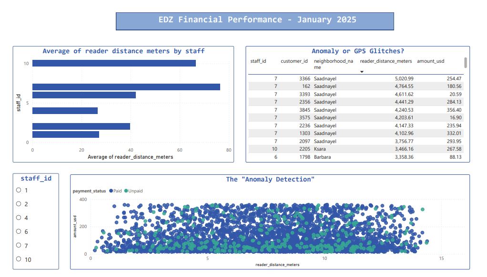

⚠️ DISCLAIMER: The data used in this project is entirely unreal and was generated randomly for portfolio demonstration purposes. Any resemblance to actual entities is coincidental.

📌 Project Overview
This project addresses revenue leakage for a regional utility company by identifying meter-reading inaccuracies and predicting financial risk. I developed an end-to-end pipeline—from MySQL data engineering to Power BI AI visuals—to automate the detection of unpaid debt.

🛠️ Tech Stack
Database: MySQL (Audit queries for distance validation).

Processing: Python (VS Code) for data preparation.

Analytics: Power BI (Key Influencers & Decomposition Trees).

🚀 Key Insights
Geospatial Audit: Identified reading errors where data was recorded from distances exceeding 3,000 meters, indicating "guessed" entries.

Revenue at Risk: Pinpointed $10,111.89 in high-risk debt linked to these inaccuracies.

AI Discovery: A Decomposition Tree revealed that Commercial connections in Saadnayel represent the highest recovery priority.

Interactive UX: Integrated a navigation menu to allow managers to jump from high-level overviews to granular risk lists.

📂 Repository Contents
SQL_Scripts/: Queries for data cleaning and distance-based risk categorization.

Python/: Script for database connection and data formatting.

EDZ_Dashboard.pbix: The final interactive report.

## 📊 Dashboard Preview

### 1. Executive Financial Overview
The high-level summary of EDZ’s financial health for January 2025. This page provides a "pulse check" on total revenue, expenses, and collection rates, allowing leadership to see performance at a glance.

### 2. Operational Audit & Geospatial Validation
This page uses SQL-driven audits to pinpoint "High Risk" meter readings. By analyzing the physical distance between the staff and the meter, we identified instances of data being recorded from over 3,000 meters away, highlighting significant operational leakage.

### 3. AI-Driven Risk Discovery
The final stage of the analysis uses a **Decomposition Tree** and **KPI Cards** to isolate $10.11K in at-risk revenue. It reveals that **Commercial** connections in **Saadnayel** are the primary drivers of unpaid debt, providing a "Priority Action List" for the collections team.

